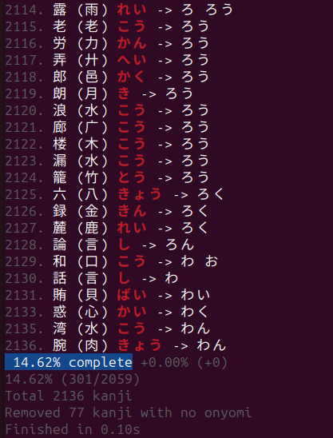

# Kanji reading predictor

## Predictor results

| predictor | precision | correct predictions |
| --------- | --------- | ------------------- |
| constant こう | 3.25% | 67 / 2059 |
| ideal radical predictor | 14.62% | 301 / 2059 |

## Usage

Run
```
./loop.sh
```
for development loop using [entr](https://github.com/eradman/entr).

or simply

```
./run.py
```
For a single evaluation.

## Screenshot


